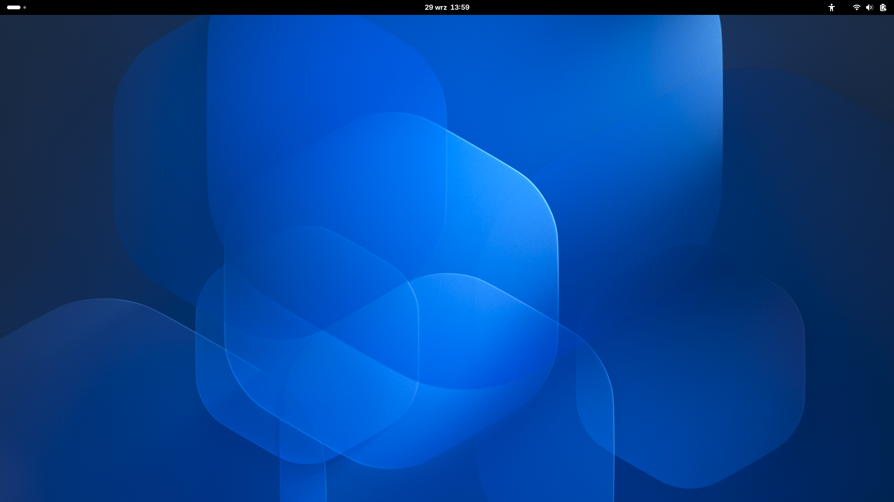
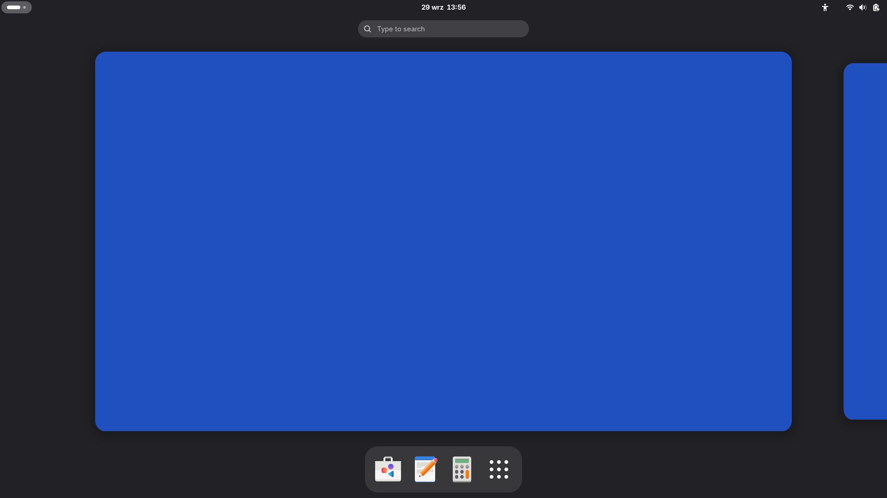
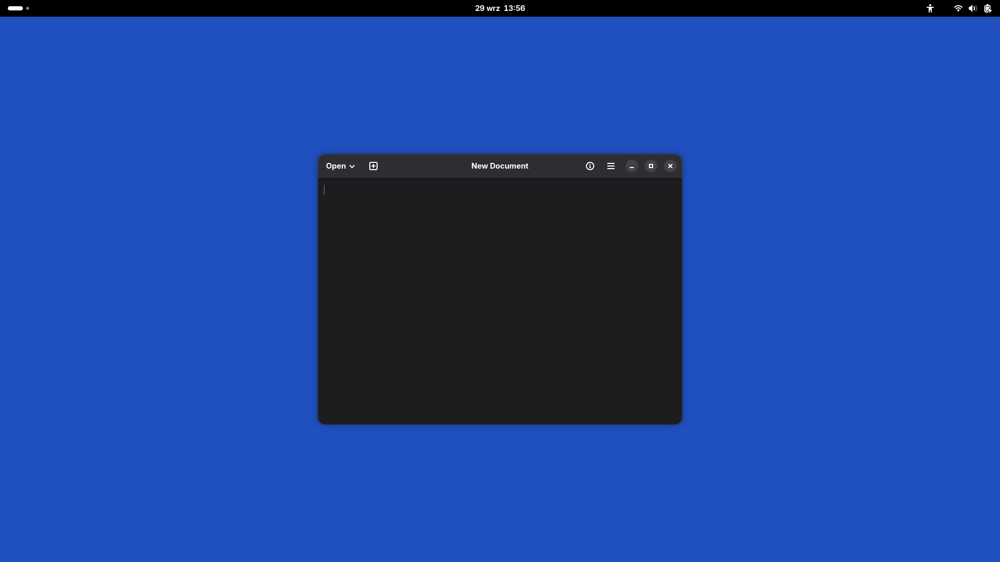

# ROG Phone 5 native Linux

Native mainline Linux 7.2.7 (plus about 100 device patches) with Arch Linux ARM
on the ASUS ROG Phone 5 (Qualcomm SM8350 / Snapdragon 888). The phone UI is
Phosh; an optional GNOME "desktop mode" runs on an external monitor. The same
installation also works as a small server: SSH, Tailscale, an nftables firewall
and a 128 GiB persistent root filesystem.

This is a device-specific, experimental port. Android does not run underneath:
the mainline kernel runs directly on the hardware.

## Status

As of 2026-09-29.

### What works

| Area | Status |
|---|---|
| Boot | From local storage via a signed slot-B boot chain with automatic fallback (try-once selector) |
| Display | AMOLED panel; Phosh at 1080x2448 |
| Input | Touchscreen |
| Wireless | Wi-Fi (NetworkManager), Bluetooth |
| Audio | Speakers (24-bit), built-in microphones |
| Sensors | Through the SLPI sensor DSP |
| Power | Charging, including charge limit and bypass; suspend-to-idle (about 27 mA while suspended) |
| Watchdog | Haven/Gunyah hardware watchdog |
| USB | Side USB-C as host, including hubs; bottom USB-C as USB 2.0 host |
| External display | USB-C DisplayPort alt mode to an HDMI hub at 1920x1080@60 (HBR link rate) |
| Desktop mode | GNOME on the external monitor, started from a launcher on the unlocked phone; the phone screen becomes a touchpad |
| GPU | Hardware acceleration with Mesa freedreno/turnip (Adreno 660) |
| CPU | Scheduling with the stock capacity/energy model |

### Benchmarks

| Benchmark | This port | Typical Android SD888 |
|---|---|---|
| Geekbench 6 CPU, single-core | 1580 | ~1450-1500 |
| Geekbench 6 CPU, multi-core | 4191 | ~3550-3650 |
| Geekbench 6 Vulkan | ~4950-5140 | |

The Vulkan result requires the included drirc turnip workaround
`tu_restrict_subgroup_size_64` (see [`configs/drirc/`](configs/drirc/)).

### Partial / known issues

- DisplayPort at HBR2 shows lane errors, so 3840x1080 is not available yet.
- Desktop mode currently pins the display core clock and bus vote while GNOME
  runs; an underrun when DP is the only output is under investigation.
- Deep sleep (CXPC / DDR collapse) is not reached.
- AMOLED brightness has coarse steps only.
- Phosh crashes when a monitor is hot-unplugged (it restarts automatically).

### Not yet / out of scope

Cellular modem, cameras, fingerprint reader, NFC.

## Screenshots

GNOME desktop mode on an external monitor, driven by the phone:

## How it boots

1. Slot B: the ASUS bootloader starts a signed recovery wrapper (the ASUS 5.4
   kernel with a small recovery initramfs).
2. The wrapper reads a selector with a **try-once primary** and a **fallback**
   bundle, verifies the Ed25519-signed bundle (kernel image, DTB, initramfs,
   manifest) and kexecs into mainline Linux. A primary that does not commit a
   healthy boot is not retried; the next boot uses the fallback.
3. The root filesystem is a read-only Arch Linux ARM image with a persistent
   overlay stored on `userdata`.
4. Slot A keeps stock ASUS Android as the rescue and charging route.

> [!WARNING]
> Never boot slot A Android normally. Its fstab expects an encrypted f2fs
> `userdata` marked formattable, so Android would format the partition that now
> holds the Linux root overlay. See the stock-capture section of the
> [2026-09-24 report](test-results/2026-09-24-power-idle-ddr.md) and the manual
> rescue steps in [development](docs/development.md).

The signing key is kept outside the repository.

## Repository layout

| Path | Purpose |
|---|---|
| `patches/` | Kernel series (`linux-7.2.7/` is production) and userspace patches (Denial, Flutter, GTK, Wayland) |
| `dts/` | SM8350 / ROG Phone 5 device trees and overlays |
| `configs/` | Kernel fragments, systemd units, Phosh and GNOME desktop settings, firewall, udev, drirc, test registry |
| `initramfs/` | Boot-time init, slot-B loader, persistent-root attestation, updater and rescue sources |
| `packaging/` | Arch (and historical Alpine) packaging and host services |
| `scripts/host/` | Builders, packaging, RAM trials, orchestration (`rog5-dev`) and host tests |
| `scripts/device/` | On-phone helpers and their unit tests |
| `tools/` | Native helpers and verifiers (audio, GPU, LEDs, haptics, Wi-Fi, power diagnostics) |
| `manifests/` | Artifact records, candidate identities and acceptance policy |
| `containers/` | Reproducible builder and verifier containers |
| `third_party/` | Vendored tools with their upstream notices |
| `tests/`, `test-fixtures/` | Fixtures for the repository test suites |
| `test-results/` | Dated, redacted hardware and offline evidence |
| `docs/` | Documentation (see below) |
| `build/`, `artifacts/` | Build outputs, mostly ignored by Git; a few pinned CI fixtures |

## Documentation

Start at the [documentation index](docs/README.md). The authoritative handoff
is [current state](docs/current-state.md) (read its generated block first).
[Development](docs/development.md) covers building, the fast module loop,
making a kernel the default and manual rescue. [ROADMAP.md](ROADMAP.md) lists
outstanding priorities.

## Licensing and provenance

No project-wide license has been selected yet; existing per-file notices apply.
See [licensing and provenance](docs/licensing-provenance.md). Proprietary
firmware, signing keys, credentials and per-device backups are not in this
repository.
