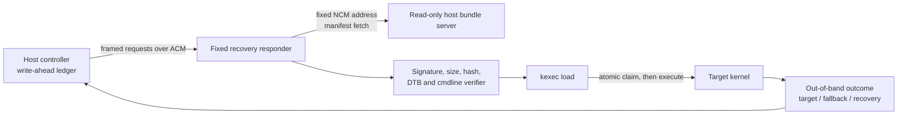

# Stable recovery control plane

Status: **design and test plan; not yet implemented**

Live authority: **none**

Last reviewed: 2026-07-28

The current recovery transport is reliable enough to reach USB, but its
control plane is not reliable enough to authorize another payload execution.
`initramfs/recovery-init` starts an interactive shell on `/dev/ttyGS0`, and
the host sends shell text and searches terminal output for marker strings.
Echo, cursor queries, serial-open races, stale output, and loss of the USB
connection during `kexec -e` make that protocol ambiguous.

The next recovery revision is a single deliberate re-freeze. It must replace
the shell with a small fixed-function responder, make retries safe for
read-only operations, make execution at-most-once per recovery boot, and
separate the stable recovery image from runtime kernel/DTB/initramfs bundles.
No new live payload gate should run before the offline suite in this document
passes.

## Invariants

The recovery platform must preserve all of these properties:

1. It is entered only with an attended, manifest-pinned `fastboot boot`.
   Nothing is flashed.
2. The Android/fallback slot remains untouched.
3. Root is RAM-backed. Physical block devices are made read-only before USB
   binds, and no block-backed filesystem is mounted.
4. A rollback watchdog remains armed until an accepted target takes over.
5. The ACM endpoint accepts no shell syntax and exposes no arbitrary command
   execution.
6. Every request and response is framed and correlated by a request ID.
7. The device, not the host, mints a fresh session ID once per recovery boot.
8. Read-only and preparation requests are idempotent. Execution is claimed
   atomically on the device and is never automatically retried.
9. Runtime payloads are accepted only when a manifest verifies against a
   trust root embedded in the frozen recovery image.
10. Kernel command-line input is structured and allowlisted. An arbitrary
    command-line string is never accepted.

## Boundary



ACM is the control channel. NCM carries larger files. The responder constructs
the only permitted fetch location itself; requests cannot provide a general
URL. The first version should use a fixed host address and port and a strict
bundle identifier:

```text
http://169.254.77.1:8080/bundles/<bundle-id>/
```

`<bundle-id>` is limited to 1–64 lowercase ASCII letters, digits, `.`, `_`,
and `-`; it cannot begin with punctuation or contain `..`.

## Framing

Use a bounded netstring carrying canonical ASCII `key=value` records:

```text
<decimal-byte-length>:<payload>,
```

The maximum payload is 4096 bytes. The parser must tolerate a frame split
across any number of reads and multiple frames in one read. It must reject
leading-zero lengths, non-decimal lengths, oversized frames, missing commas,
duplicate keys, unknown keys, embedded NUL, and non-ASCII input.

A request has these common fields:

```text
version=1
kind=request
session=<32 lowercase hex characters>
request=<32 lowercase hex characters>
verb=<fixed verb>
body_sha256=<64 lowercase hex characters>
```

A response repeats `session`, `request`, and `verb`, and adds a fixed result
code. `HELLO` is the only request allowed with an all-zero session. Its
response returns the device-minted session ID. USB already provides link
integrity; `body_sha256` protects canonical request identity and replay
matching rather than replacing manifest signatures.

The responder opens `/dev/ttyGS0` itself, applies raw/no-echo termios, and
never starts a login shell. The same interactive-shell removal applies to
`initramfs/recovery-init`, `initramfs/network-root-init`, and
`initramfs/persistent-root-init`.

## Fixed verbs and state

The first protocol needs only four verbs:

| Verb | Effect | Retry rule |
|---|---|---|
| `HELLO` | Return protocol version, capabilities, and current session ID | Safe |
| `STATUS` | Return session, prepared bundle, commit state, watchdog state, and last fixed error | Safe |
| `PREPARE` | Fetch and verify one signed bundle, then perform `kexec -l` with validated arguments | Safe only with the same request ID and body |
| `COMMIT_EXEC` | Atomically claim the prepared bundle, flush a `CLAIMED` response, then call `kexec -e` | Never retransmit after an unknown outcome |

One session may prepare only one bundle. A repeated request ID with the same
canonical body returns the cached result. Reusing an ID with a different body
returns `REQUEST_CONFLICT`.

The device creates `/run/rog5-control/session` before USB binds using kernel
randomness and mode `0600`. It also keeps a bounded replay ledger in the same
RAM filesystem. Responder restarts reuse that session and ledger; a full
recovery reboot creates a new session and rejects stale requests.

Before `COMMIT_EXEC` calls `kexec -e`, it must:

1. verify that the referenced `PREPARE` transaction is still current;
2. create the commit claim with `O_CREAT|O_EXCL`;
3. write and `fsync` the claim, then `fsync` its directory;
4. send and drain a `CLAIMED` response;
5. call `kexec -e` directly with `execve`, never through a shell.

If `kexec -e` returns, the device records `EXEC_FAILED` and remains
fail-closed until rollback. A duplicate commit never calls `kexec` again; it
returns the recorded state if the responder is still alive. If USB disappears
before the host receives a response, the result is `UNKNOWN`, not success or
failure.

## Host write-ahead ledger

The host cannot implement at-most-once semantics by itself. Its ledger becomes
meaningful only after `HELLO` supplies a device-minted session.

Before transmitting `COMMIT_EXEC`, the host writes a record containing the
device session, request ID, prepared-manifest hash, target identity, and
timestamp. It uses temporary-file + `fsync` + atomic rename + directory
`fsync` under an XDG state directory outside the repository. It marks the
record `TRANSMITTED` before writing to ACM.

After transmission:

- a clear protocol rejection resolves the record as rejected;
- a target with the expected identity resolves it as executed;
- the exact fallback with a changed boot ID resolves it as target not
  accepted, while preserving whether execution itself was observed;
- the same recovery session may resolve it through `STATUS`;
- transport loss without one of those observations remains `UNKNOWN`.

The host never sends a second `COMMIT_EXEC` for a `TRANSMITTED` request. A new
device session is a new attended cycle, not permission to repeat a consumed
payload automatically.

## Runtime bundle trust

The stable image embeds only a public verification key and policy. A runtime
bundle contains:

- protocol and manifest version;
- bundle ID and purpose;
- kernel, DTB, and optional initramfs size and SHA-256;
- expected target kernel release and USB/SSH identity;
- a structured command-line policy;
- rollback timeout and target acceptance timeout within frozen bounds;
- a detached signature over canonical manifest bytes.

The command-line policy represents fields rather than text. The first version
should permit only reviewed console, log level, root mode, NFS identity,
read-only storage, and ramoops parameters. It must reject at least arbitrary
`init=`, arbitrary `root=`, unknown keys, duplicate keys, unsafe memory
overlaps, writable-root flags, and unbounded timeouts.

No signing key has been created. Creating or using that credential requires a
separate user confirmation. Until then, the implementation and tests can use
an ephemeral test key that is generated inside a temporary test directory
and never accepted by a production recovery image.

## Retained-marker limitation

The fallback command line reserves 4 MiB for ramoops, including a 3 MiB
console area, but the current fallback cannot read it:

- the reservation has zero users and no bound driver;
- `ramoops_bound=0`;
- `/dev/mem` and BusyBox `devmem` are absent;
- `CONFIG_DEVMEM` is unset;
- no matching module build environment is available.

Therefore changing the fallback pstore-empty gate would remove a safety check
without creating an evidence channel. Keep that gate unchanged.

The preferred future experiment is to build pstore/ramoops support into the
new staging recovery and test whether the reserved region survives a
target-to-recovery transition. Alternatives are a separate temporary reader
boot or an offline investigation of the possible Qualcomm USB-C debug UART.
None is a prerequisite for implementing the framed protocol, and none may be
claimed working before a controlled test.

## Test suite before re-freeze

### Parser and protocol unit tests

- every possible split point for a valid frame;
- multiple frames in one read;
- truncated, oversized, malformed, duplicate-key, unknown-key, NUL, and
  non-ASCII input;
- request-ID replay with same and different bodies;
- stale and all-zero session rejection;
- fixed-verb and fixed-field enforcement;
- bounded ledger eviction without evicting the active commit.

### State-model tests

- `HELLO -> PREPARE -> COMMIT_EXEC`;
- duplicate `PREPARE` returns the cached result;
- second bundle in one session is rejected;
- duplicate commit never increments an execute counter;
- crash before claim, after claim, after reply, and after simulated execute;
- `kexec -e` return records a permanent session failure;
- fresh recovery session rejects every stale request;
- watchdog remains armed on all parser, fetch, verification, and execute
  failures.

### Pseudo-terminal integration tests

Run the real responder against `openpty(3)` with fault injection:

- delayed open and initial read race;
- partial writes and reads;
- disconnect before and after the atomic claim;
- responder restart with `/run` state retained;
- dropped response followed by safe `STATUS`;
- terminal echo and cursor queries are absent;
- arbitrary shell text is rejected and never reaches `execve`.

### Bundle and security tests

- valid signature and all pinned hashes pass;
- changed manifest, payload, DTB, signature, or size fails;
- untrusted key and path traversal fail;
- oversized files and decompression bombs fail before allocation;
- invalid DTB compatibility, reserved-memory overlap, and command-line field
  fail;
- fetch is limited to the fixed NCM host and bundle path;
- no physical storage mount or write command exists in the image.

### Reproducibility and image tests

- two clean responder builds are byte-identical;
- two clean initramfs and wrapper builds are byte-identical;
- verifier proves storage gates run before responder start and UDC bind;
- verifier proves there is no `sh -i`, getty, authorized key, private key, or
  arbitrary command path in any of the three initramfs variants;
- the re-freeze updates the source/hash/verifier pins together;
- the temporary-boot allowlist admits only the newly accepted stable image.

### Live promotion sequence

1. Two attended staging-only cycles: exact image, RAM root, all physical
   devices read-only, ACM/NCM, no payload load, automatic rollback.
2. Two protocol-only cycles with malformed/replayed requests and no kexec.
3. One load-only cycle with a signed inert payload and automatic rollback.
4. One separately authorized execute cycle with host write-ahead intent and
   out-of-band target/fallback classification.

Each live cycle gets one invocation. A transport timeout never authorizes a
retry.

## Rollout order

1. Implement the parser/state reference model and fault-injection tests.
2. Implement the static responder and pseudo-terminal integration tests.
3. Add signed-manifest and structured-command-line verification.
4. Remove all three interactive shells and update image verifiers.
5. Rebuild once, reproducibly, and create a new temporary-boot candidate.
6. Run the staging-only promotion sequence.
7. Only then implement the host ledger against the device-minted session.
8. Investigate recovery-side retained-marker reading and USB-C debug UART
   independently.

The accepted v18 image remains a legacy staging transport while this work is
offline. Its payload helpers are evidence only; they are not an active live
gate.
