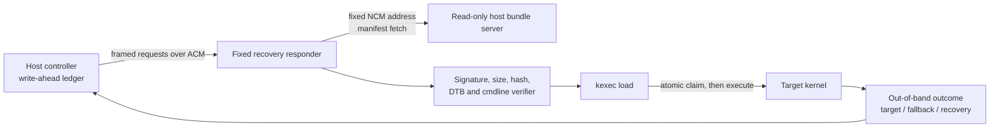

# Stable recovery control plane

Status: **shell-free framed path is established; diagnostic Generations 0–12
are consumed. Generation 10 proved correlated `REQUEST_ACCEPTED` plus complete
host transfer, then lost ACM before any later progress or `PREPARED` response
reached the host. Generation 11 reached exact recovery ACM/NCM, but its
privileged host path rejected the started TCP 8081 progress collector as not
uniquely confined before recovery control began. No PREPARE, transfer, COMMIT
intent, NFS, or target occurred; Generation 11 is permanently claimed and must
never be retried. Generation 12 corrected that host boundary, transferred and
verified the complete bundle, accepted correlated PREPARE/COMMIT, and reached
target stage 70 `nfs-mount-begin`; USB disconnected before stage 80. Exact
watchdog fallback and cleanup passed. Generation 12 is consumed and absent from
policy. The outer lifecycle parser is corrected, and the shell-free responder
now fails closed unless it proves the exact Haven watchdog handoff before
execution. That correction is refrozen only in authority-free offline
execution/observer twins; physical retention and reset cause remain unproven.**

Artifact-local authority: **none**. Live use occurs only through the central
standing authorization and this document's exact technical gates.

Last reviewed: 2026-08-10

The executable stdlib-only reference model is in
`tools/recovery_control/reference.py`; its host test is
`scripts/host/test-recovery-control-reference.py`. It defines protocol and
crash semantics for the native responder.

The native C source is
`tools/recovery_control/rog5-recovery-control.c`; its pseudo-terminal suite is
`scripts/host/test-recovery-control-native.py`, and its pinned AArch64 builder
is `scripts/device/build-recovery-control.sh`. The reproducibility/QEMU
aggregate is `scripts/host/test-recovery-control-aarch64.sh`. Host and
QEMU-backed AArch64 tests exercise the same source. The repository-owned
`configs/recovery-control/aarch64-build-v1.json` record pins that source, the
builder script, ARM64 image/toolchain, and resulting binary. Exact-head CI
checks the record against repository bytes; the separate private ARM64 clean
build proves the output digest, and retention admission requires both recovery
roles to embed it. The production compile has
no test backend or path override. It now invokes the privilege-separated
fixed-host acquisition helper under the rollback watchdog, invokes the fixed
verifier, receives the exact verified file descriptors, and performs a
bounded legacy `kexec_load`. Those binaries are now integrated into the
shell-free stable-recovery initramfs and reproducible ASUS 5.4 wrapper using
only a disposable trust root. The exact verifier and acquisition
contracts are documented in
[recovery runtime bundle contract](recovery-bundle-contract.md) and
[fixed recovery bundle transport](recovery-fetch-contract.md). The resulting
image was used once through an exact guarded runner and remains outside the
durable temporary-boot allowlist. That action grants no repeat authority.

The host side now has a fixed one-shot stdlib server plus a root-owned
PolicyKit controller. It recognizes exactly one recovery NCM gadget, binds
only `169.254.77.1:8080`, applies runtime-only source/destination firewall
rules, drops to the caller with no capabilities, verifies the exact listener,
and removes every state item it created. The fixed controller was installed
root-owned through PolicyKit and used for the attended transaction. It
temporarily handed the exact UUID-pinned shared fallback/recovery `/30`
profile to recovery and restored that same profile afterward,
then restored the exact profile, firewall forwarding flag, interface, and
rules. A nonce-bound root-owned marker now attests the already-verified
NFSv4.2 listener to the unprivileged control client without requiring access
to root-only `/proc/fs/nfsd` files.

`scripts/host/prepare-recovery-candidate.py` is the first manifest-driven
offline adapter into the runtime-bundle packager. Its initial record maps the
consumed persistent-root P2 kernel, DTB, and initramfs to
`persistent-root-ro-v1`, verifies their tracked identities before packaging,
and refuses any record other than `status=consumed` and `authority=none`.
The adapter contains no server, transport, phone, or execution action. It
proves preparation parity only; integrating the fixed server/verifier/
executor remains an A0.4 task.

The former recovery control plane used an interactive shell on
`/dev/ttyGS0`; echo, cursor queries, serial-open races, stale output, and loss
of the USB connection during `kexec -e` made outcomes ambiguous. The
stable-recovery candidate replaces that shell with a fixed-function
responder, makes read-only retries safe, makes execution at-most-once per
recovery boot, and separates the stable recovery image from signed runtime
kernel/DTB/initramfs bundles. The first signed live execution returned to
fallback before SSH because the candidate selected historical DTB v1. The
corrected target remains non-runnable until a new trust root, complete
release-pin update, independent review, and one standing-authorized live
sequence admitted by the exact lifecycle gates are complete. See the
[live result](../test-results/2026-07-29-headless-stable-recovery-live.md).

## Invariants

The recovery platform must preserve all of these properties:

1. It is entered only with an attended, manifest-pinned `fastboot boot`.
   Nothing is flashed.
2. The Android/fallback slot remains untouched.
3. Root is RAM-backed. Physical block devices are made read-only before USB
   binds, the ASUS 5.4 wrapper must expose the measured 116-node topology,
   and no block-backed filesystem is mounted.
4. A rollback watchdog remains armed until an accepted target takes over.
5. The ACM endpoint accepts no shell syntax and exposes no arbitrary command
   execution.
6. Every request, advisory progress record, and response is framed and
   correlated by session and request ID.
7. The device, not the host, mints a fresh session ID once per recovery boot.
8. Read-only and preparation requests are idempotent. Execution is claimed
   atomically on the device and is never automatically retried.
9. Runtime payloads are accepted only when a manifest verifies against a
   trust root embedded in the frozen recovery image.
10. Kernel command-line input is structured and allowlisted. An arbitrary
    command-line string is never accepted.

## Boundary



ACM is the control channel. NCM carries larger files. The responder passes
only a strict bundle identifier and expected manifest hash to the fixed
acquisition helper; requests cannot provide a URL, host, interface, or port.
The helper binds `usb0` and source `169.254.77.2`, then connects only to
`169.254.77.1:8080`. It uses the canonical length-framed binary stream in
[fixed recovery bundle transport](recovery-fetch-contract.md), not HTTP:

```text
format=rog5-fetch-request-v1
bundle=<bundle-id>
manifest_sha256=<expected-hash>
```

`<bundle-id>` is limited to 1–64 lowercase ASCII letters, digits, `.`, `_`,
and `-`; it cannot begin with punctuation, contain `..`, or equal the reserved
unset value `none`.

## Framing

Use a bounded netstring carrying canonical ASCII `key=value` records:

```text
<decimal-byte-length>:<payload>,
```

The maximum payload is 4096 bytes. One parser feed is capped at 8192 bytes and
32 frames; callers perform additional bounded reads as needed. The parser must
tolerate a frame split across any number of reads and multiple frames in one
read. It must reject leading-zero lengths, non-decimal lengths, oversized
frames, missing commas, duplicate keys, unknown keys, embedded NUL, non-ASCII
input, and a truncated frame at end of stream.

A request has these common fields:

```text
version=1
kind=request
session=<32 lowercase hex characters>
request=<32 lowercase hex characters>
verb=<fixed verb>
body_sha256=<64 lowercase hex characters>
```

A response repeats `session`, `request`, and `verb`, adds a fixed result code,
and returns a body containing the exact state, prepared bundle, manifest hash,
prepare request, commit request, commit fingerprint, execution-started marker,
watchdog state, last fixed error, and immutable boot-time postmortem metadata.
The postmortem fields are state (`UNAVAILABLE`, `EMPTY`, or `PRESENT`), record
count, total record bytes, snapshot SHA-256, and up to 512 bytes of
hex-encoded snapshot tail. Its `body_sha256` covers all canonical fields.
`HELLO` is the only request allowed with an all-zero session. Its response
returns the device-minted session ID. USB already provides link integrity;
body hashes protect canonical request/response identity and replay matching
rather than replacing manifest signatures.

During a newly executed `PREPARE`, the responder may emit canonical advisory
progress records before the terminal response. Each record has
`kind=progress`, `verb=PREPARE`, the exact session and request IDs, and a
body-hashed tuple of sequence, phase, bundle, manifest hash, and
`watchdog=ARMED`. The only valid ordered phases are:

1. `REQUEST_ACCEPTED`;
2. `FETCH_COMPLETE`;
3. `VERIFY_COMPLETE`;
4. `KEXEC_LOAD_COMPLETE`; and
5. `PREPARED_PERSISTED`.

The sequence number is fixed by that list. A trace is valid only as a
contiguous prefix for one attempt; duplicate, skipped, reordered, stale,
cross-request, cross-bundle, or cross-manifest records fail closed on the
host. Progress never changes recovery state, records a decision, or authorizes
`COMMIT_EXEC`. If one progress frame cannot be sent, the responder suppresses
all later progress frames and every later write on that potentially partial
frame stream. It still completes the existing safe PREPARE pipeline and
decision ledger so a new same-session connection can replay the terminal
decision without appending a response to a poisoned frame.

All-zero request IDs and manifest hashes are reserved unset values and are
rejected. Fixed result codes are bound to their valid verb and transaction
state. `EXEC_FAILED` normally requires the persisted execution-started marker.
The sole pre-execution exception is `last_error=HAVEN_WDOG_FAILED`, which
requires `execution_started=NO` and proves that the already-consumed claim was
refused before target execution. Successful target departure is classified
out of band; the last recoverable device state remains `CLAIMED` with
`execution_started=YES`.

The responder opens `/dev/ttyGS0` itself, applies raw/no-echo termios, and
uses nonblocking I/O with fixed deadlines for a started frame, response
writes, and output drain. An idle poll continues to check the live watchdog.
An incomplete prefix or body and a stalled write or drain close the
connection without authorizing execution. The responder never starts a login
shell. The same interactive-shell removal applies to
`initramfs/recovery-init`, `initramfs/network-root-init`, and
`initramfs/persistent-root-init`.

The native parser reads one bounded frame at a time, so it never accumulates a
multi-frame input batch. Coalesced frames remain in the TTY queue and are
handled as separate bounded dispatches.

The stable initramfs build exports a fixed C locale and UTC timezone before
archive traversal. Its integration gate compares builds made under different
caller locales and time zones, locks the root account, removes login/password
and DHCP entry points, and rejects credential-like or set-ID content. The
fixed device address lives only in `/init`; the boot command line contains no
legacy `rog5.recovery_cidr` input.

## Fixed verbs and state

The first protocol needs only four verbs:

| Verb | Effect | Retry rule |
|---|---|---|
| `HELLO` | Return protocol version, capabilities, and current session ID | Safe |
| `STATUS` | Return session, prepared bundle, commit state, watchdog state, and last fixed error | Safe |
| `PREPARE` | Fetch and verify one signed bundle, then perform `kexec -l` with validated arguments | Safe only with the same request ID and body |
| `COMMIT_EXEC` | Atomically claim the prepared bundle, flush a `CLAIMED` response, then call `kexec -e` | Never retransmit after an unknown outcome |

`PREPARE` executes one fixed pipeline:

1. `/usr/libexec/rog5-bundle-fetch <bundle> <manifest-hash>`;
2. `/usr/libexec/rog5-bundle-verify --handoff-fd3 ...`; and
3. `/usr/sbin/kexec -c -l` using only the three sealed descriptors.

`REQUEST_ACCEPTED` is emitted only after session, replay-ledger, state, and
capacity guards pass. The next three phases follow successful fetch, accepted
verified-plan/descriptor handoff, and successful kexec load respectively.
`PREPARED_PERSISTED` follows immutable prepared-state publication and precedes
the terminal `PREPARED` response. A replay reconstructed from the durable RAM
state returns only the terminal response and does not fabricate historical
progress.

The responder gives the fetch helper a 65-second outer deadline and checks
the rollback-watchdog pidfd throughout. Fetcher exit 42 becomes the permanent
`BUNDLE_ID_CONFLICT` decision. Any other acquisition failure or timeout
becomes `FETCH_FAILED`. Both are written to the replay ledger, and neither
path can invoke the verifier, loader, unload, or executor.

One session may prepare only one bundle. For mutating verbs, a repeated
request ID with the same canonical body returns its immutable recorded
decision combined with the current monotonic state. After successful
preparation or a terminal `FETCH_FAILED`/`BUNDLE_ID_CONFLICT` acquisition
decision, another PREPARE request ID returns `PREPARE_ID_CONFLICT` without
refetching. A verifier rejection may be retried only under a new request ID;
the old ID always replays its original `VERIFY_FAILED` decision. The
authoritative successful prepare ID remains required by `COMMIT_EXEC`.
Reusing any mutation ID with a different body or verb returns
`REQUEST_CONFLICT`. Each decision records its original verb so cross-verb
replay cannot reinterpret or crash on the result. `HELLO` and `STATUS` are
read-only current-state queries and do not consume replay-ledger entries.

The device creates `/run/rog5-control/session` before USB binds using kernel
randomness and mode `0600`. It also keeps a bounded replay ledger in the same
RAM filesystem. Entries are not evicted during a recovery session. Three idle
slots are protected at the boundary: one lets a failed `PREPARE` decision be
recorded exactly once, while a successful `PREPARE` and its exact
`COMMIT_EXEC` need at most two entries. No verifier runs once fewer than three
idle slots remain, and only the matching commit may use the final transaction
capacity after preparation. Other new mutations return `LEDGER_FULL`.
`STATUS` remains available even at full capacity. Responder restarts reuse the
session and ledger; a full recovery reboot creates a new session and rejects
stale requests.

The responder does not trust a pathname-only watchdog marker. At startup it
opens an owner-private lease containing the watchdog PID and Linux process
start time, validates that identity through `/proc`, pins it with `pidfd_open`,
and polls the pidfd while ACM is absent, at idle, during framing, response,
drain, and both sides of the execution marker. The production executor checks
again before fork and child exec; its parent monitors and reaps the child
while waiting. PID reuse and a dead or replaced lease fail closed.

## Exact-object PREPARE boundary

After fixed-host acquisition publishes a finalized bundle, `PREPARE` forks
only `/usr/libexec/rog5-bundle-verify` with the requested bundle and manifest
hash. A private nonblocking Unix `SOCK_SEQPACKET` socket is the only
authorization channel. The verifier first copies each source into a
write-sealed `memfd`, then verifies and sends one bounded canonical plan plus
exactly three `SCM_RIGHTS` descriptors for those immutable kernel, DTB, and
initramfs snapshots. The responder rejects a wrong peer identity, truncation,
additional ancillary data, wrong descriptor count or type, missing seals,
aliases, unsafe metadata, nonzero offsets, verifier failure, timeout, and any
plan/request mismatch. Every descriptor installed by a malformed rights
packet is closed before rejection.

Received descriptors are close-on-exec in the responder. Only the loader child
clears that flag, immediately rechecks the watchdog, and directly executes:

```text
/usr/sbin/kexec -c -l /proc/self/fd/<kernel-fd>
    --initrd=/proc/self/fd/<initramfs-fd>
    --dtb=/proc/self/fd/<dtb-fd>
    --command-line=<verified-generated-command-line>
```

The fixed `-c` is required: the accepted ASUS staging kernel and custom DTB
use the legacy `kexec_load` path, matching the previously accepted device
loaders. The parent monitors and reaps both children under fixed deadlines,
closes all descriptors, and persists `PREPARED` only after the loader exits
zero. It never reopens an artifact through the bundle directory.

A crash after successful load but before durable `PREPARED` leaves the
transaction idle. On restart, the responder first runs fixed
`kexec -c -u`; only then may the same request safely load again. A rejected or
timed-out loader and a returned fixed executor also unload before the
responder continues. A crash after `PREPARED` is published is reconstructed
from durable RAM state and does not rerun the verifier or loader.
`COMMIT_EXEC` remains the sole non-retryable execution boundary.

Before image integration, a separately gated load-only cycle may proceed
under the central standing authorization and must use the real pinned AArch64
kexec-tools and these procfd arguments to prove
`/sys/kernel/kexec_loaded` changes from 0 to 1, that an exact repeat load is
safe, and that `kexec -c -u` returns it from 1 to 0 without target execution.
The image must mount `/proc`, expose `/proc/self/fd`, expose
`/sys/kernel/kexec_loaded`, include every kexec runtime library, and establish
the watchdog before starting the responder. The offline fake-kexec suite
proves that a loaded-then-timed-out image is unloaded and that restart
reconciles a crash after load; the staging-only live gate must prove those
same transitions against the real kernel.

Before `COMMIT_EXEC` calls `kexec -e`, it must:

1. verify that the referenced `PREPARE` transaction is still current;
2. create the commit claim with `O_CREAT|O_EXCL`, including the request
   fingerprint;
3. write and `fsync` the claim, then `fsync` its directory;
4. send and drain a `CLAIMED` response;
5. while the userspace rollback watchdog remains live, open the fixed
   `/sys/bus/platform/drivers/hh-watchdog` directory and prove that it contains
   exactly one bound device whose `driver` resolves back to that directory and
   whose exact DT compatible is `qcom,hh-watchdog`;
6. establish a `/dev/kmsg` sequence boundary, make exactly one `1\n` write to
   that device's owner-only `disable` control, revalidate the pinned identity,
   require exact `1\n` readback, and reject any new
   `Failed to deactivate secure wdog` or `failed disabling VDOG` kernel
   record; and
7. call `kexec -e` directly with `execve`, never through a shell.

The Haven handoff has no production path override, glob, retry, or alternate
device fallback. Any missing, duplicate, rebound, unsafe, unreadable, or
unverified control persists `HAVEN_WDOG_FAILED`, unloads the prepared image,
and leaves the irreversible claim consumed without an execution-started
marker. This preserves the separate userspace rollback layer and prevents the
mainline target from inheriting the recovery kernel's actively serviced Haven
watchdog.

Immediately before calling `kexec -e`, and only after that handoff succeeds,
the responder persists an execution-started marker. If `kexec -e` returns, the
device records `EXEC_FAILED` and remains fail-closed until rollback. A
duplicate commit or a responder restart after the claim, failure, or execution
marker never calls `kexec` again; it returns the recorded transaction identity
and state if the responder is still alive. If USB disappears before the host
receives a response, the result is `UNKNOWN`, not success or failure.

## Host write-ahead ledger

The host cannot implement at-most-once semantics by itself. Its ledger becomes
meaningful only after `HELLO` supplies a device-minted session.

The live host client is `scripts/host/stable-recovery-control.py`. It discovers
only the exact recovery ACM identity, performs `HELLO`, permits one same-ID
`PREPARE` replay after a transport loss, writes the existing durable intent
before `COMMIT_EXEC`, and never retransmits that commit. A lost commit response
therefore remains `UNKNOWN` until an out-of-band target, fallback, or recovery
observation resolves it.

For PREPARE, the host parser accepts fragmented or coalesced progress and
terminal frames, validates one exact contiguous trace per attempt, and starts
a fresh sequence namespace for the sole same-session replay. If initial or
replay transport fails, the bounded error retains both transport classifiers
and the last correlated phase prefix from each attempt. The trace is evidence,
not authority: the host still requires a correlated terminal `PREPARED` before
running any pre-commit gate or creating a durable COMMIT intent.

There is intentionally no claimed in-band `WATCHDOG_EXIT` frame: watchdog
reset can remove ACM before such a frame is drained. Every progress record
proves only that the watchdog was armed at that boundary. Watchdog exit and
fallback remain independently observed by the lifecycle, so the last device
phase plus the USB/fallback timeline locates a loss without inventing a final
device record.
Ledger resolution is separately guarded by
`ALLOW_RECOVERY_INTENT_RESOLVE=1`; it is set only after the recorded target
identity or exact fallback observation has been captured.

`scripts/host/run-stable-recovery-live-gate.sh` is the separate boot boundary.
It requires two byte-identical ignored-directory wrapper builds, re-verifies
the embedded public key and fixed binaries, verifies the signed runtime bundle
and AVB footer, accepts only fastboot product `lahaina`, and contains only
`fastboot boot`. It does not add an ephemeral image to the durable boot
allowlist.

Before transmitting `COMMIT_EXEC`, the host writes a record containing the
device session, request ID, prepared-manifest hash, target identity, and
timestamp. It uses temporary-file + `fsync` + atomic rename + directory
`fsync` under an XDG state directory outside the repository. The durable
record is keyed by device session, with the request ID inside it, so choosing
a fresh request ID cannot bypass an unknown prior commit. It marks the record
`TRANSMITTED` before writing to ACM.

After transmission:

- a clear protocol rejection resolves the record as rejected;
- a target with the expected identity resolves it as executed;
- the exact fallback with a changed boot ID resolves it as target not
  accepted without inferring whether execution occurred unless that was
  independently observed;
- the same recovery session may resolve it through `STATUS`;
- transport loss without one of those observations remains `UNKNOWN`.

The host never sends a second `COMMIT_EXEC` in a device session that already
has a `TRANSMITTED` record, even if a caller supplies a new request ID. A new
device session is a new attended cycle, not permission to repeat a consumed
payload automatically.

## Runtime bundle trust

The exact first-version format, bounds, fixed paths, generated command line,
FDT policy, reproducible build, and remaining integration gates are in
[recovery runtime bundle contract](recovery-bundle-contract.md). The stable
image embeds only a public verification key and policy. A runtime bundle
contains:

- protocol and manifest version;
- bundle ID and purpose;
- kernel, DTB, and mandatory initramfs size and SHA-256;
- expected target kernel release and USB/SSH identity;
- a structured command-line policy;
- rollback timeout and target acceptance timeout within frozen bounds;
- a detached signature over canonical manifest bytes.

The first version does not accept command-line fields or text from the
manifest. It generates an exact command line from the fixed profile, validated
bundle ID, and bounded rollback timeout. That narrower rule rejects arbitrary
`init=`, `root=`, unknown keys, duplicates, writable-root flags, and unbounded
timeouts by construction.

No production signing key has been created. Disposable keys have been used
for offline tests and the consumed attended bundle; their private material was
not retained. The corrected target, bundle, shell-free initramfs, and wrapper
now pass a complete twin-build offline gate under one destroyed disposable
key. A live target still requires a newly generated single-use or admitted
production trust root and a rebuilt/allowlisted wrapper. The central standing
authorization covers one technically admitted cycle; the consumed live trust
root cannot authorize another bundle.
See the
[corrected offline result](../test-results/2026-07-29-corrected-headless-candidate-offline.md).

## PREPARE transport and replay evidence

`PREPARE` is retry-safe only inside the same recovery session and under one
absolute deadline. If the initial framed exchange loses ACM before returning a
correlated response, the host closes that descriptor and performs one stable
ACM discovery tagged `prepare-replay`. It replays the identical request only if
the recovered `HELLO` returns the same session. `COMMIT_EXEC` remains
non-retryable and is not part of this path.

The host must not let replay discovery overwrite the reason replay was needed.
A failed replay therefore reports one bounded terminal record containing:

- the fixed initial PREPARE transport-loss reason;
- the explicit `prepare-replay` phase; and
- saturated ACM state counts, bounded state transitions, fixed identity-field
  labels, and a truncation bit without device identity values.

This closes the Generation-9 host observability defect: a later Alpine product
mismatch can no longer masquerade as the initial recovery failure. Generation
10 then proved that ACM progress alone can still disappear after
`REQUEST_ACCEPTED`. The separate receive-only
[NCM progress contract](recovery-ncm-progress.md) now has a bounded device
sender, host collector core, and hostile hardware-free tests. It is advisory
and cannot authorize COMMIT. Privileged broker/lifecycle integration and the
exact AArch64 gate remain mandatory before another recovery image is issued.

## Postmortem outcome oracle

The installed fallback reserves 4 MiB for ramoops but cannot read it:

- the reservation has zero users and no bound driver;
- `ramoops_bound=0`;
- `/dev/mem` and BusyBox `devmem` are absent;
- `CONFIG_DEVMEM` is unset;
- no matching module build environment is available.

The stable recovery wrapper does not share that limitation: its pinned config
already has built-in `PSTORE`, `PSTORE_CONSOLE`, and `PSTORE_RAM`, and its
boot-v3 command line carries the exact reservation. Before starting the
framed responder, recovery now mounts pstore read-only in practice, copies
bounded regular records into a private RAM snapshot without unlinking them,
and publishes canonical metadata. The responder now validates both the
owner-only status and the complete fixed snapshot before creating a control
session. It requires private regular no-follow files, exact aggregate record
framing, the 64-record/4-MiB bounds, matching record/payload counts, aggregate
SHA-256, and the exact final 512-byte tail already carried by the status.

The responder scans the validated payloads for the exact
`rog5-target-lineage-v1` candidate/boot-ID marker. It accepts the marker at a
line start or after only the two formats emitted by the accepted target:
`[time] ` from `console-ramoops` and canonical `<priority>[time] ` from panic
`dmesg-ramoops`. Arbitrary prefixes, malformed lookalikes, and distinct valid
markers are ambiguous. Responses expose only marker multiplicity and the
SHA-256 of one exact marker; that syntactic state is not a current-cycle match
claim.

For correlation, the read-only host action
`stable-recovery-control.py postmortem-status CANDIDATE BOOT_ID` validates the
expected identity before device discovery, computes the exact expected marker
hash, and emits one redacted record classified as `UNAVAILABLE`, `NO_RECORDS`,
`NO_MARKER`, `AMBIGUOUS`, `DIFFERENT_MARKER`, `MATCH`, or
`MATCH_REPEATED`. It does not emit the responder's reversible tail field or
raw pstore content. The generic `status` command remains the raw diagnostic
action and must not be used as a correlation claim. The three lineage fields
extend the fixed `version=1` response schema, so this re-freeze is deliberately
fail-closed rather than wire-compatible with an older peer: recovery and host
must be deployed from the same reviewed repository checkpoint.

Offline tests prove empty, present, unavailable, malformed, aggregate and
metadata disagreement, hostile path types, printk formatting, stale-marker
classification, redaction, partial-I/O, and restart behavior. They do **not**
prove the Snapdragon DRAM region survives a target → bootloader → recovery
transition. That requires a separately admitted controlled live cycle. If it
does not survive, the next oracle experiment remains the possible Qualcomm
debug UART; no physical UART capability is currently claimed.

The [offline refreeze](../test-results/2026-08-09-recovery-postmortem-refreeze-offline.md)
subsequently integrated this exact responder into twin shell-free initramfses
and two clean, source-sealed ASUS 5.4 wrapper builds. Config, kernel, initramfs,
raw boot-v3, unsigned AVB, and source seals compare byte-for-byte, and the
inspected product retains the exact 4 MiB ramoops reservation. This is complete
composition evidence, not retention evidence or boot authority. A future live
retention experiment must use distinct one-use execution and observation
recovery identities; it may not replay one candidate after an ambiguous
result.

The fallback leg now has a separate machine-enforced read-only preflight:

```text
reboot-fallback-to-fastboot.sh retention-preflight
```

It first retains the helper's exact fallback health checks, then requires the
same seven ramoops command-line values used by the target and observer, the
exact two-cell `0x9b800000 + 0x400000` reserved-memory tuple, no overlapping
fixed sibling reservation, no visible ramoops-compatible or bound platform
consumer, and no pstore entry. It cannot request a reboot and does not accept
the reboot authorization guard. The embedded verifier disables Python
bytecode writes and revalidates child-property, driver, and optional mount
inventories so a path appearing during an absence check fails closed. Passing
it proves only the fallback's observable runtime state at that point; it does
not establish that firmware preserved the bytes. See the
[offline result](../test-results/2026-08-09-fallback-ramoops-transition-preflight-offline.md).

Stable recovery's UDC selection is now independently fail-closed. The
[offline exact-UDC checkpoint](../test-results/2026-08-09-stable-recovery-exact-udc-offline.md)
removes the former arbitrary-first fallback and requires one stable exact
`a600000.dwc3`, with revalidation immediately before and after configfs
binding. Delayed exact enumeration remains accepted; zero-at-deadline, wrong,
renamed, multiple, and changing candidates retain the armed rollback and
never reach a usable control transport. This changes no protocol or boot
authority and does not prove physical enumeration.

Future postmortem inspection now has a separate fail-closed initramfs
composition. PID 1 validates a root-owned, regular, non-symlink, single-link,
mode-`0444` `/etc/rog5/recovery-mode` before configuring USB. `full-v1`
retains the existing bundle root and execution protocol;
`observation-only-v1` requires the bundle root to be absent and starts the
same reviewed responder with an explicit observation mode. In that mode only
`HELLO` and `STATUS` can succeed. `PREPARE` and `COMMIT_EXEC` return
`OBSERVATION_ONLY` before state transition, ledger write, helper invocation,
or kexec reconciliation, and startup rejects any nonpristine retained state.

The observation archive further removes `/usr/libexec/rog5-bundle-fetch`,
`/usr/libexec/rog5-bundle-verify`,
`/etc/rog5/recovery-bundle-ed25519.pub`, and
`/usr/sbin/kexec`. Its verifier has a distinct
`observation-only-a600000-v1` contract; current full, current observation, and
hash-pinned historical archives cannot be substituted for one another. This
is defense in depth around a mode-bound responder, not a claim that one
binary can safely infer its role from missing tools. The
[offline result](../test-results/2026-08-09-observation-only-recovery-offline.md)
proves reproducible initramfs composition and hostile refusal only. It does
not provide an outer wrapper, boot authority, or evidence that ramoops
survives a physical transition.

## Test suite before re-freeze

### Parser and protocol unit tests

- every possible split point for a valid frame;
- multiple frames in one read;
- truncated, oversized, malformed, duplicate-key, unknown-key, NUL, and
  non-ASCII input;
- request-ID replay with same and different bodies;
- stale and all-zero session rejection;
- fixed-verb, fixed-field, result/state, and reserved-sentinel enforcement;
- ledger-capacity exhaustion before processing, with no in-session eviction.

### State-model tests

- `HELLO -> PREPARE -> COMMIT_EXEC`;
- duplicate same-ID `PREPARE` returns its immutable decision with current
  state;
- same-bundle `PREPARE` with a new ID is rejected;
- second bundle in one session is rejected;
- duplicate commit never increments an execute counter;
- crash before claim, after claim, after reply, and after simulated execute;
- crash before/after immutable writes, file fsync, link, unlink, rename, and
  directory fsync;
- `kexec -e` return records a permanent session failure;
- fresh recovery session rejects every stale request;
- watchdog remains armed on all parser, fetch, verification, and execute
  failures.

### Pseudo-terminal integration tests

Run the real responder against `openpty(3)` with fault injection:

- delayed open and initial read race;
- partial writes and reads;
- incomplete-prefix/body timeouts, forced short writes, and drain timeout;
- disconnect before and after the atomic claim;
- watchdog death at startup, idle, before response, and after the execution
  marker;
- responder restart with `/run` state retained;
- dropped response followed by safe `STATUS`;
- `STATUS` correlates the exact prepare ID, commit ID/fingerprint, manifest,
  execution marker, watchdog, and last error;
- terminal echo and cursor queries are absent;
- arbitrary shell text is rejected and never reaches `execve`;
- sealed verified snapshots survive replacement and in-place overwrite of
  every bundle pathname;
- malformed plans, short or unsafe rights, nonzero verifier exit, and loader
  failure never create `PREPARED`;
- zero-byte and over-count rights packets never leak descriptors;
- rights packets up to Linux's 253-descriptor maximum are fully drained and
  rejected without leaks, while successful PREPARE also preserves the parent
  descriptor count;
- verifier and loader timeout or watchdog death kill and boundedly reap their
  child;
- watchdog death during verification is terminal;
- loaded-then-timeout, crash-after-load restart, and returned execution unload
  before another action; and
- the fixed execution child is boundedly killed and reaped on watchdog death.

### Bundle and security tests

- valid signature and all pinned hashes pass;
- changed manifest, payload, DTB, signature, or size fails;
- untrusted key and path traversal fail;
- oversized files and decompression bombs fail before allocation;
- invalid DTB compatibility, reserved-memory overlap, and command-line field
  fail;
- fetch is limited to the fixed NCM host and bundle path;
- no physical storage mount or write command exists in the image.

### Reproducibility and image tests

- two clean responder builds are byte-identical;
- two clean initramfs and wrapper builds are byte-identical;
- verifier proves storage gates run before responder start and UDC bind;
- verifier proves there is no `sh -i`, getty, authorized key, private key, or
  arbitrary command path in any of the three initramfs variants;
- the re-freeze updates the source/hash/verifier pins together;
- the temporary-boot allowlist admits only the newly accepted stable image.

### Live promotion sequence

1. Two attended staging-only cycles: exact image, RAM root, all physical
   devices read-only, ACM/NCM, no payload load, automatic rollback.
2. Two protocol-only cycles with malformed/replayed requests and no kexec.
3. One load-only cycle with a signed inert payload and automatic rollback.
4. One separately gated execute cycle under the central standing authorization,
   with host write-ahead intent and out-of-band target/fallback classification.

Each live cycle gets one invocation. A transport timeout never authorizes a
retry.

Recovery ACM enumeration failures are classified before any Generation-9
issuance. The host keeps only fixed state names, sample counts saturated at
999, at most 16 transitions, and the names—not values—of changed identity
fields. Any uninspectable ACM node fails closed. This diagnostic layer is
observational: it does not weaken exact product selection, read/write access,
the two-second stable-identity dwell, final revalidation, or the one-invocation
rule. See the
[offline classifier result](../test-results/2026-08-03-generation-9-recovery-acm-classifier-offline.md).

## Rollout order

1. Implement the parser/state reference model and fault-injection tests.
2. Implement the static responder and pseudo-terminal integration tests.
3. Add signed-manifest and fixed-command-line verification. **Complete
   offline.**
4. Add same-descriptor legacy `kexec_load` and integrate the verifier with
   `PREPARE`. **Complete offline and integrated into the shell-free
   initramfs.**
5. Connect the offline-tested fixed-host fetch helper to `PREPARE`.
   **Complete offline and integrated into the shell-free initramfs.**
6. Add the fixed read-only host-serving command and controller/firewall
   integration. **Complete and live-proven with exact cleanup.**
7. Remove all three interactive shells and update image verifiers.
   **Complete offline.**
8. Build the initramfs, wrapper, raw boot-v3 image, and AVB wrapper twice.
   **Complete reproducibly and used for one attended signed transaction;
   production trust root and release pins remain absent.**
9. Create the production-key candidate and update all release pins
   atomically.
10. Run the staging-only promotion sequence. **The shell-free wrapper,
    transport, signed PREPARE/COMMIT, target NCM, rollback, and host cleanup
    passed once; corrected-target SSH remains pending.**
11. Integrate the tested host-ledger semantics with the native responder and
    device-minted session. **Complete and live-proven for one commit resolved
    as `FALLBACK_RETURNED`.**
12. Investigate recovery-side retained-marker reading and USB-C debug UART
   independently.

The accepted v18 image remains a legacy staging transport while this work is
offline. Its payload helpers are evidence only; they are not an active live
gate.
