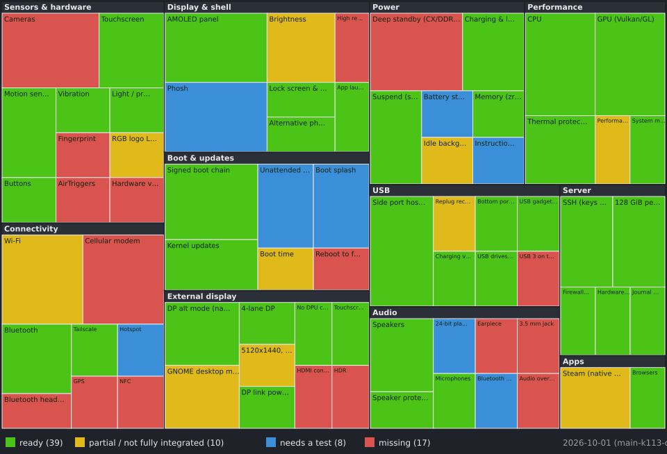

# What's left (short version)

As of 2026-09-29, kernel bundle r187. The picture below shows the same list
at a glance (green ready, yellow partial, blue needs a test, red missing);
it is generated from [`status/components.json`](status/components.json) by
`tools/status-map/render.py`.

## Missing

- **Phone calls / mobile data / GPS**: the modem is not brought up (out of
  scope for now).
- **Cameras, fingerprint reader, NFC, AirTriggers**: no drivers yet.
- **Earpiece, 3.5 mm headphone jack, Bluetooth headset microphone**.
- **Deep standby**: the phone sleeps, but memory never enters its deepest
  state (~79 mA in standby). Another processor keeps it awake; still being
  traced.
- **High refresh rate (90/120/144 Hz)** and **4K / ultrawide on HDMI**.
- **"Restart to fastboot"** from Linux (it currently just reboots).

## Works, but not fully finished

- **Phosh closes all apps when an HDMI monitor is plugged/unplugged**, and
  when switching between phone and desktop mode.
- **Wi-Fi** needs ~11 s to reconnect after the phone wakes (the address is
  now stable across reboots).
- **Brightness** has only about 4 real steps.
- **Desktop mode** forces the display chip to a fixed high clock while GNOME
  runs (safe, but warmer).
- **Performance mode** exists only as a command (`sudo rog5-perf-mode
  performance` / `normal`), not yet as a Phosh toggle.
- **Unattended updates** may reboot the phone while it serves something with
  the screen off.
- **Boot screen**: r187 should keep the ASUS logo until the spinner (needs your visual check).
- **Bottom USB port** needs its 5 V switched on by hand (`rog5-usb-bottom on`).

Details and causes: [`user-irritations.md`](user-irritations.md).

## Tests only you can do (need hands, a cable or a monitor)

| # | Test | What to do | Tell me |
|---|---|---|---|
| 1 | Battery standby | Unplug the phone, lock it, leave it 1-2 h | Battery % before/after (I'll read the current from the logs) |
| 2 | HDMI without the clock pin | Plug the hub + monitor, tap "Desktop mode" | Picture OK? Blue screen or flicker? |
| 3 | Monitor unplug | Unplug HDMI while in Phosh | Did Phosh restart / apps close? |
| 4 | Resources app | Unlock, open Resources, look at CPU and GPU | Names, load, clock and temperature shown? |
| 5 | Settings > About | Open it | "Cortex-A55 x4 / A78 x3 / X1" shown? |
| 6 | Performance mode | `sudo rog5-perf-mode performance`, play/benchmark a while | Faster? Case too hot to hold? Then `normal` |
| 7 | Bluetooth audio | Pair headphones, play music | Works? Sound quality? |
| 8 | Hotspot | Turn on the Wi-Fi hotspot, connect another device | Internet on the other device? |
| 9 | Boot screen | Reboot and watch the screen | What glitches do you see and when? |
| 10 | Next fastboot visit | Run `fastboot getvar all` (read-only) | Paste the output (slot flags) |
